# Library Management System

A full-stack web application for managing a library system with Django backend and React frontend.

## Project Structure

```
python-assignment/
├── server/          # Django backend
│   ├── library_management/  # Django project settings
│   ├── library/             # Main library app
│   ├── manage.py
│   └── requirements.txt
└── client/          # React frontend
    ├── src/
    │   ├── components/      # React components
    │   ├── services/        # API service layer
    │   └── App.jsx
    └── package.json
```

## Features

### Backend (Django)

- **Books Management**: CRUD operations for books with stock tracking
- **Members Management**: CRUD operations for members with debt tracking
- **Transactions**: Issue and return books with rent fee calculation
- **Business Logic**:
  - Debt limit validation (Rs. 500 maximum)
  - Stock management on issue/return
  - Rent fee tracking
- **Import API**: Fetch books from Frappe Library API and save to database

### Frontend (React)

- **Books Page**: Search, add, edit, delete books
- **Members Page**: Manage members with debt visualization
- **Transactions Page**: Issue and return books with filters
- **Import Page**: Import books from Frappe API with filters

## Screenshots

### Books Management

#### Books List View

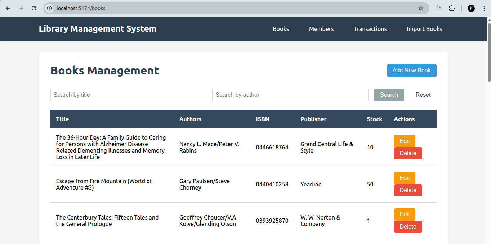

#### Search Books by Title

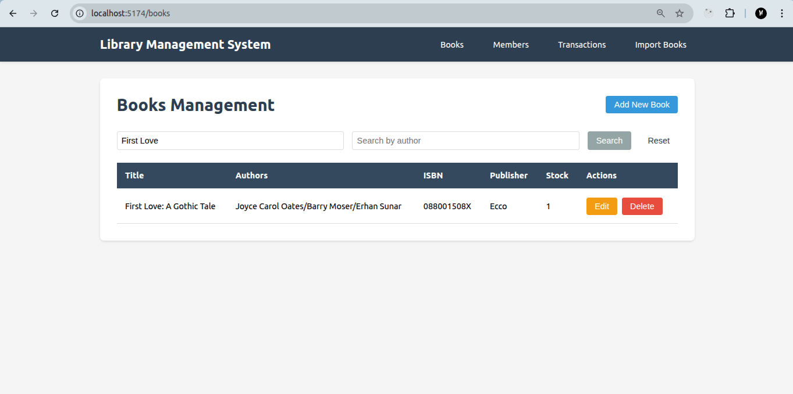

#### Search Books by Author

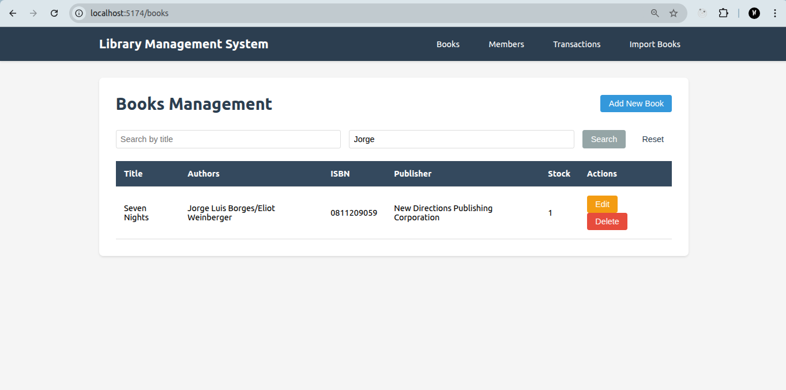

#### Add Book Form

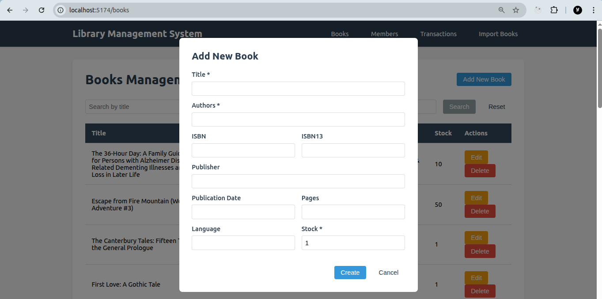

#### Edit Book Form

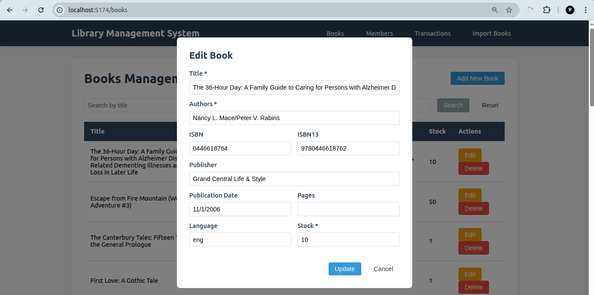

### Members Management

#### Members List View

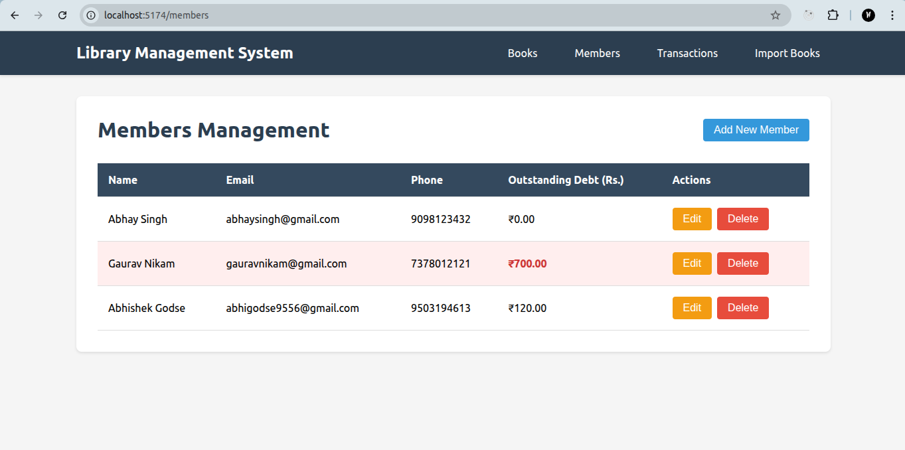

#### Add Member Form

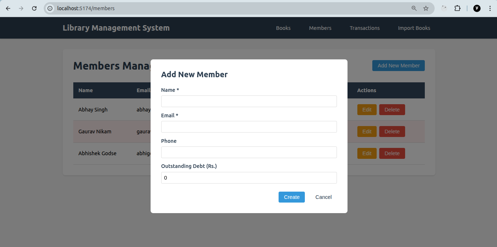

#### Edit Member Form

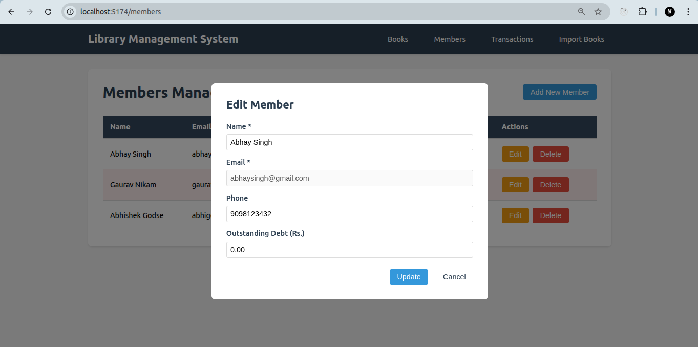

### Transactions Management

#### All Transactions View

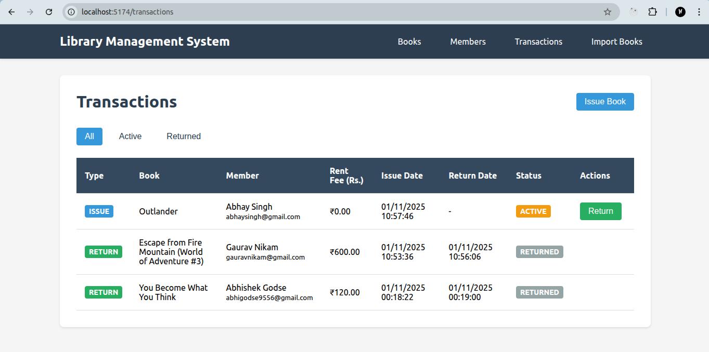

#### Active Transactions

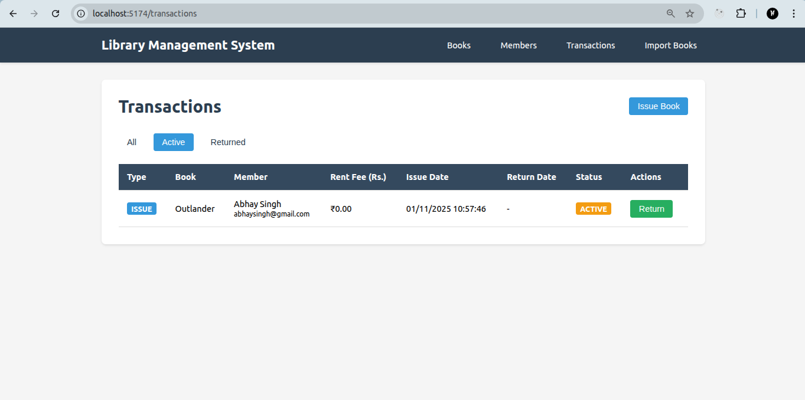

#### Returned Transactions

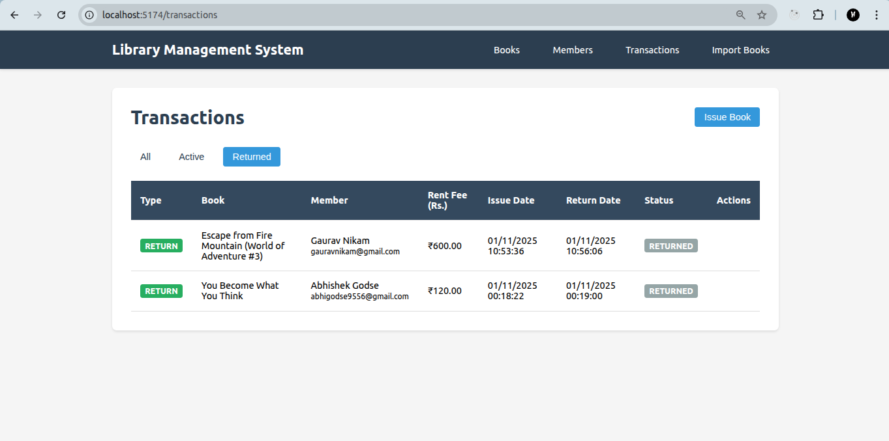

#### Issue Book Form

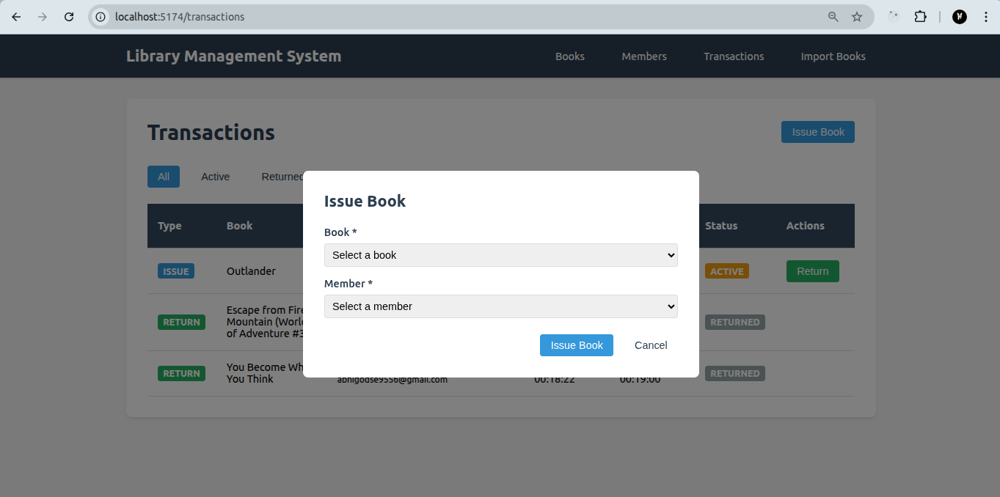

#### Return Book Form

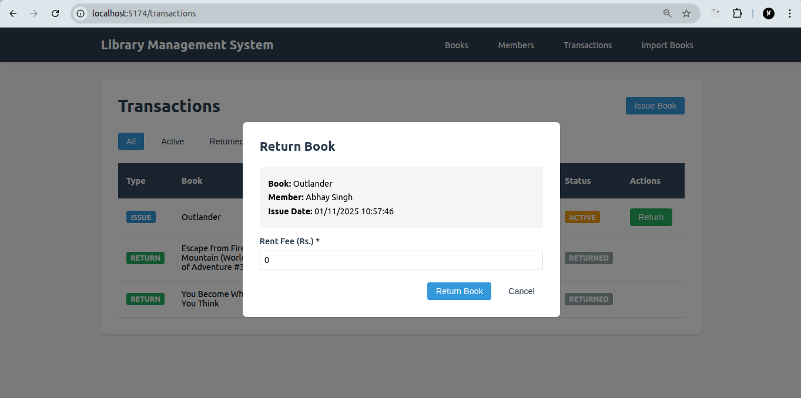

### Import Books from Frappe API

#### Import Books Page

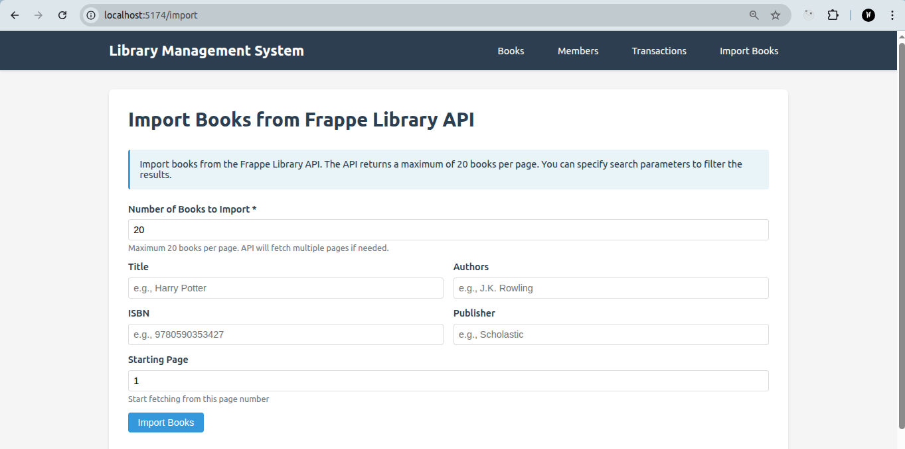

#### Import Books from Frappe API

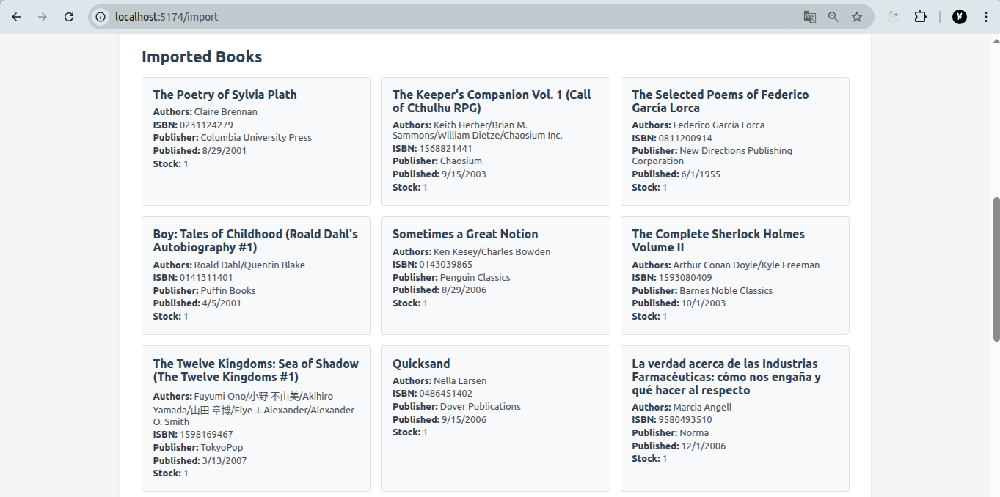

## Setup Instructions

### Backend Setup

1. Navigate to the server directory:

```bash
cd server
```

2. Create a virtual environment (optional but recommended):

```bash
python3 -m venv venv
source venv/bin/activate  # On Windows: venv\Scripts\activate
```

3. Install dependencies:

```bash
pip3 install -r requirements.txt
```

**Note**:

- If `pip3` is not found, install it first: `sudo apt install python3-pip`
- If you're using a virtual environment (recommended), after activating it you can use `pip` instead of `pip3`.

4. Run migrations:

```bash
python3 manage.py makemigrations
python3 manage.py migrate
```

**Note**: If you're using a virtual environment, after activating it you can use `python` instead of `python3`.

5. Create a superuser (optional, for Django admin):

```bash
python3 manage.py createsuperuser
```

6. Start the development server:

```bash
python3 manage.py runserver
```

The backend will run on `http://127.0.0.1:8000`

### Frontend Setup

1. Navigate to the client directory:

```bash
cd client
```

2. Install dependencies:

```bash
npm install
```

3. Start the development server:

```bash
npm run dev
```

The frontend will run on `http://localhost:5173`

## API Endpoints

### Books

- `GET /api/books` - List all books
- `GET /api/books?search=query` - Search books
- `GET /api/books?title=harry&author=rowling` - Filter books
- `GET /api/books/<id>` - Get book details
- `POST /api/books` - Create a book
- `PUT /api/books/<id>` - Update a book
- `DELETE /api/books/<id>` - Delete a book

### Members

- `GET /api/members` - List all members
- `GET /api/members/<id>` - Get member details
- `POST /api/members` - Create a member
- `PUT /api/members/<id>` - Update a member
- `DELETE /api/members/<id>` - Delete a member

### Transactions

- `GET /api/transactions` - List all transactions
- `GET /api/transactions?member=<id>` - Get transactions by member
- `GET /api/transactions?book=<id>` - Get transactions by book
- `GET /api/transactions?is_active=true` - Get active transactions

### Issue Book

- `POST /api/issue` - Issue a book to a member
  ```json
  {
    "book_id": 1,
    "member_id": 1
  }
  ```

### Return Book

- `POST /api/return` - Return a book and charge rent fee
  ```json
  {
    "transaction_id": 1,
    "rent_fee": 50.0
  }
  ```

### Import Books

- `GET /api/import-books?count=40&title=harry` - Import books from Frappe API
  - Parameters: `count`, `title`, `authors`, `isbn`, `publisher`, `page`

## Business Rules

1. **Debt Limit**: Members cannot issue books if their outstanding debt is ≥ Rs. 500
2. **Stock Management**: Book stock decreases on issue and increases on return
3. **Rent Fee**: Rent fee is charged on return and added to member's outstanding debt
4. **Active Transactions**: Only active transactions can be returned

## Technologies Used

- **Backend**: Django 4.2.7, Django REST Framework 3.14.0
- **Frontend**: React 18.2.0, React Router 6.20.0, Vite 5.0.8
- **Database**: SQLite (default, can be changed to PostgreSQL/MySQL)
- **External API**: Frappe Library API

## Notes

- The application assumes single-user access (librarian only)
- No authentication/session management required as per assignment
- The Frappe API returns max 20 books per page, so the import function handles pagination automatically
